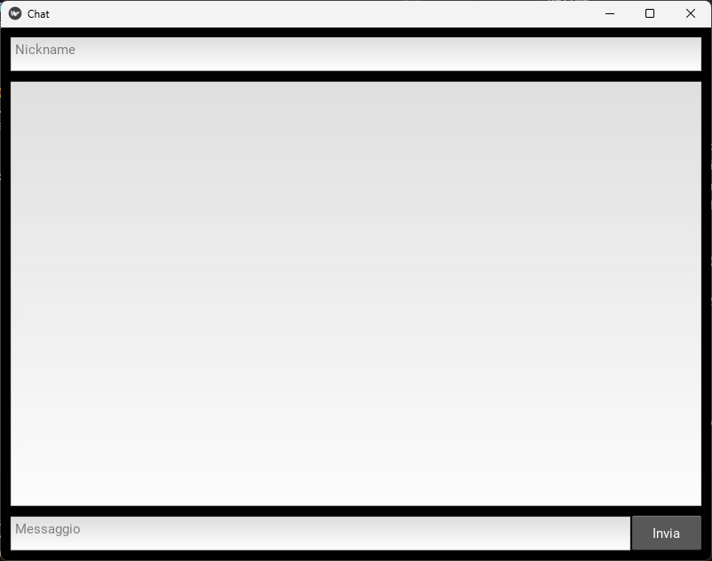

# Chat di Classe 🧑‍🏫💬

**Chat di Classe** è una semplice applicazione di messaggistica istantanea pensata per un contesto scolastico. Permette a più utenti di comunicare in tempo reale tramite una chat condivisa, usando un'architettura a microservizi con backend Node.js, WebSocket, Redis e frontend in Python con Kivy/KivyMD.

---

## 🔧 Funzionalità principali

### ✅ Frontend (Kivy/KivyMD)
- Inserimento del **nickname personale**
- Scrittura e invio di **messaggi**
- Visualizzazione **in tempo reale** tramite WebSocket

### ✅ Backend (Node.js + Express)
- Ricezione e salvataggio dei messaggi
- Pubblicazione in tempo reale dei messaggi tramite Redis pub/sub
- Validazione minima dei dati

### ✅ WebSocket Service
- Notifica a tutti i client connessi quando arriva un nuovo messaggio
- Comunicazione in tempo reale grazie a Redis

### ✅ Redis
- Salvataggio dei messaggi come JSON con:
  - `timestamp`
  - `nickname`
  - `message`

---

## 🗂️ Struttura del progetto

```
chat-di-classe/  
├── backend/  
│   ├── server.js  
│   ├── redisClient.js  
│   └── routes/  
│       └── messages.js  
├── websocket-service/  
│   └── ws-server.js  
├── frontend/  
│   ├── main.py  
│   ├── chat.kv  
│   └── requirements.txt  
├── .env  
├── docker-compose.yml  
├── Dockerfile (x3: backend, ws, frontend)  
└── README.md  
```

---

## 🚀 Avvio con Docker

### 1. Avvio con Docker Compose

Assicurati di avere Docker installato. Poi lancia:

```
docker-compose up --build
```

Per usare anche il frontend grafico Kivy, verifica la configurazione X11 per abilitare l'interfaccia grafica (se su Linux). Per Windows, si consiglia esecuzione locale.

---

## 🧠 Architettura dei Servizi

### 🟢 Redis

Usato come broker e database temporaneo per la chat, grazie alla sua velocità.

### 🟡 Backend REST API (`server.js`)

Espone un endpoint `POST /messages` per ricevere messaggi dal frontend:

```
POST /messages  
Body: { "nickname": "Mario", "message": "Ciao!" }
```

I messaggi vengono salvati nella lista Redis `chat_messages` e pubblicati sul canale `new_message`.

### 🔵 WebSocket Service (`ws-server.js`)

Sottoscrive il canale `new_message` di Redis e invia i messaggi in real-time a tutti i client connessi.

---

## 💻 Frontend (Kivy)

### Requisiti

```
kivy==2.3.1  
kivymd==1.2.0  
requests  
websocket-client  
```

### Esecuzione manuale

In alternativa al container Docker, puoi eseguire:

```
cd frontend  
python main.py
```

Il frontend consente:
- Inserimento nickname
- Chat aggiornata in tempo reale
- Invio messaggi via REST API

---

## ✉️ Esempio di messaggio Redis

```json
{
  "nickname": "Mario",
  "message": "Ciao a tutti!",
  "timestamp": "2025-05-27T13:20:00.000Z"
}
```

---

## 🧪 Test e Debug

- Per testare la chat: apri più finestre o terminali, ognuno con un'istanza dell’app.
- Il backend è accessibile su `http://localhost:3000/messages`
- Il WebSocket gira su `ws://localhost:3001`

---

## 📦 Dipendenze principali

### Backend (Node.js)

```
express  
redis  
cors  
body-parser  
```

### Frontend (Python)

```
kivy  
kivymd  
requests  
websocket-client  
```

---

## 📌 Note aggiuntive

- Il salvataggio persistente dei messaggi non è richiesto in questa versione (Redis volatile).
- Non è richiesta autenticazione vera e propria: il nickname è usato come identificatore semplice.
- Nessuna registrazione utenti.
- UI chat semplificata.

---

## 📸 Screenshot



---

## 👨‍💻 Autori

- Di Gifico Matteo
- Morganti Paolo
- Spada Tommaso
